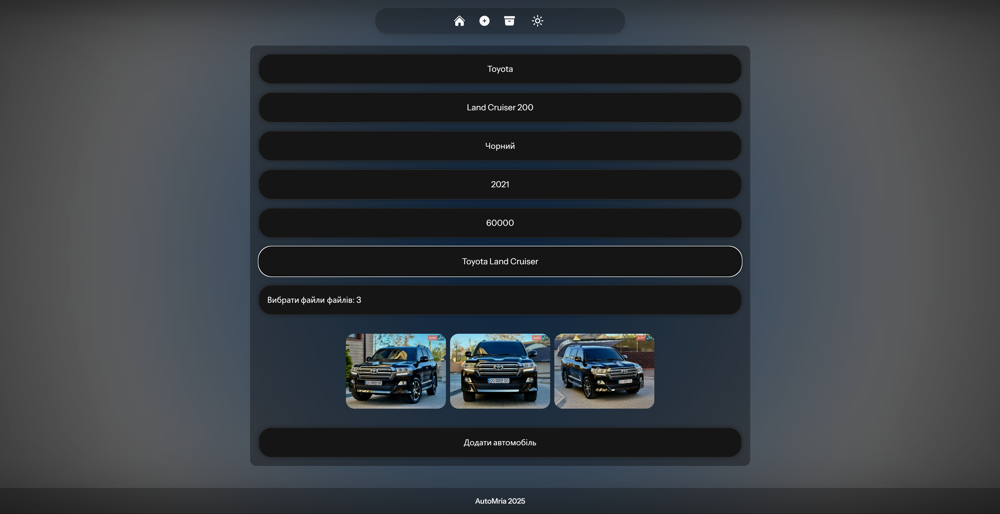
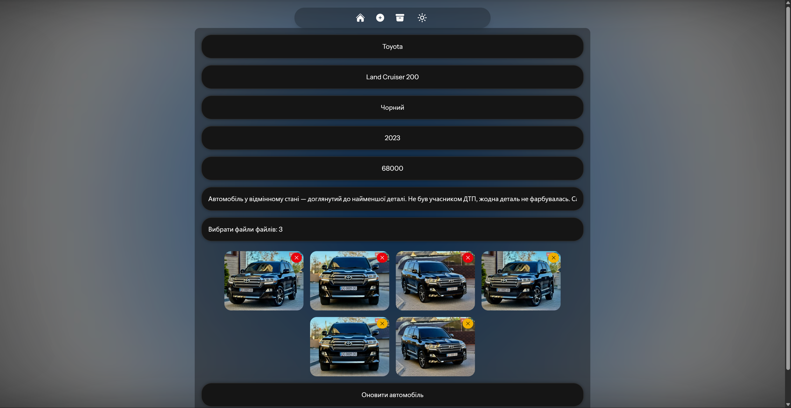

# ✨ Laravel + React CRUD App

Це витончений і сучасний CRUD-додаток для керування даними, створений на базі **Laravel** (PHP) для бекенду та **React**
для фронтенду, з акцентом на стильний дизайн у стилі Apple — плавні градієнти, розмиття та анімації дихання кольорів.

---

## ✨ Функціонал

- 📋 Перегляд списку записів
- 🔍 Перегляд детальної інформації про запис
- 🆕 Створення нового запису
- ✏️ Редагування існуючого запису
- 🗑️ Видалення запису
- 📊 **DashBoard** із своїм списком машин

---

## 🎨 Стиль і UI

- Плавні **градієнти** з ефектом «дихання» кольорів
- Розмиття фону (glassmorphism)
- М’які анімації для кнопок і переходів
- Мінімалістичний інтерфейс, натхненний дизайном Apple

---

## 🛠 Технології

| Частина  | Технологія                          |
|----------|-------------------------------------|
| Backend  | Laravel, PHP                        |
| Frontend | React, Tailwind CSS (Glassmorphism) |

---

## 📸 Скріншоти

### 🏠 Головна сторінка — Список записів

Стильні картки з розмиттям і градієнтною анімацією, що створюють відчуття легкості та прозорості.


---

### ➕ Додати новий запис

Проста і чиста форма додавання з випадаючими списками марок та моделей.



---

### 🔍 Деталі запису

Елегантне і мінімалістичне відображення інформації із плавним розмиттям фону.


---

### ✏️ Редагування запису

Проста і чиста форма редагування.



---

### 📊 DashBoard

Кабінет для перегляду, редагування та видалення списку машин.


---

### 🌙 Світла тема

Зручний інтерфейс із підтримкою світлої та темної теми для комфортного перегляду.


---

## 🚀 Запуск проєкту

```powershell
composer install
npm install
copy .env.example .env
php artisan key:generate
php artisan migrate
php artisan storage:link
xcopy public\CARS_TEST public\storage\CARS_TEST /E /I
php artisan migrate --seed
php artisan serve
npm run dev
